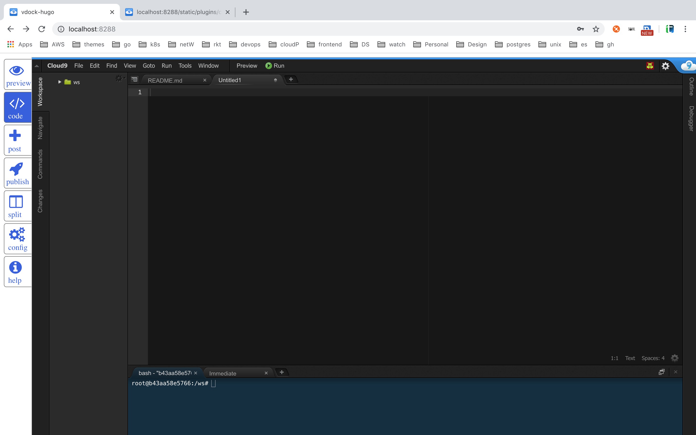
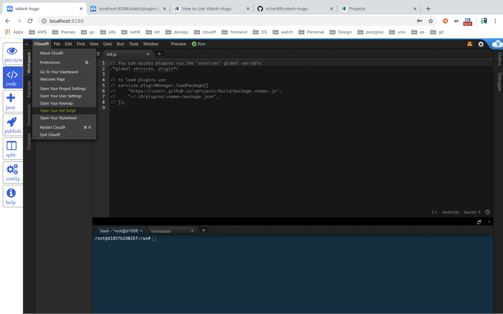
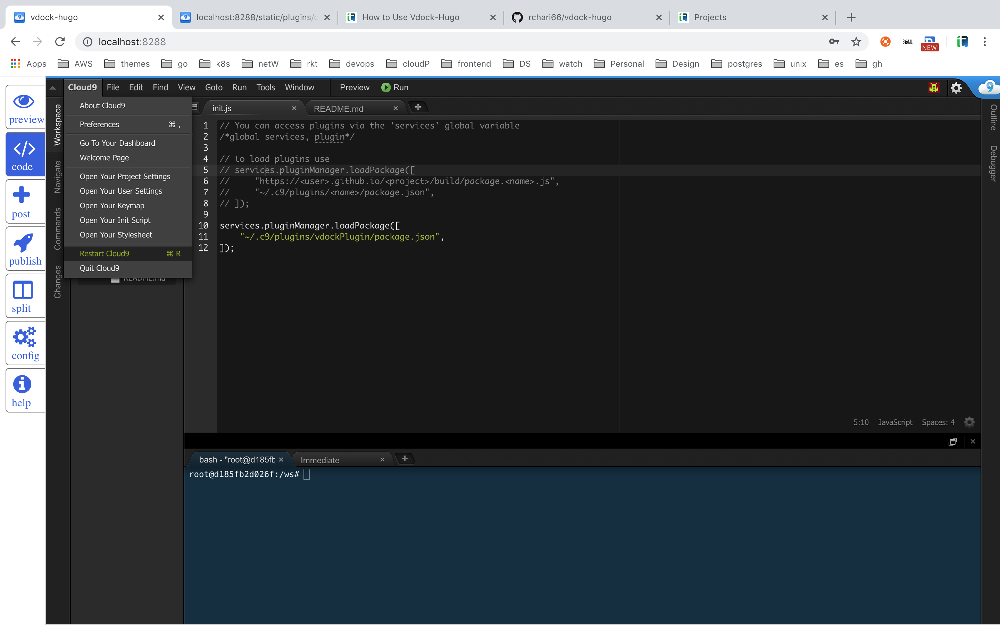

# vdock
#### Intro:
Vdock is tool with an intergrated IDE for managing [hugo](https://gohugo.io/) site efficiently. 
<br>
It provides features like
* IDE to edit the blog
* Live preview(changes)
* 1-click to create new post
* 1-click to publish final site to [github pages](https://pages.github.com/)


#### Run :
###### No Authentication & Deny Public Access
``` bash
$ docker run -td -p 8288:8288 -p 8286:8286 rchari/vdock
```
open : http://localhost:8288/




<details><summary> More Options To Run</summary>
<p>

###### With Authentication & Deny Public Access
```bash
$ docker run -td -p 8288:8288 -p 8286:8286 -e AUTH=<username>:<password> rchari/vdock
```

###### No Authentication & Allow Public Access
```bash
$ docker run -td -p 8288:8288 -p 8286:8286 -e ALLOW_PUBLIC_ACCESS=YES rchari/vdock
```
###### With Authentication & Allow Public Access
```bash
$ docker run -td -e AUTH=<username>:<password> ALLOW_PUBLIC_ACCESS=YES \
    -p 8288:8288 -p 8286:8286 rchari/vdock
```
</p>
</details>

#### Configure Snippets(One time setup) :
##### Step 1:
From `Cloud9` menu(top-left corner); select menu-option `Open Your Init Script` to open `init.js`. Now add below content to `init.js`
```
services.pluginManager.loadPackage([
    "~/.c9/plugins/vdockPlugin/package.json",
]);
```
<details><summary>Show pics</summary>
<p>
    
###### Copy above content to init.js file

---
###### Restart Cloud9


</P>
</details>

##### Step 2:
Open Cloud9 menu and click on `Restart cloud9`(short cut: `command + R` for mac). 
Restart cloud9 on every edit you make to snippet file(s) in `ws/vdockPlugin/snippets/`.

---
> Note: In config.toml(hugo configuration file) `publishDir` should point to `../site`.
```toml
publishDir = "../site"
```

