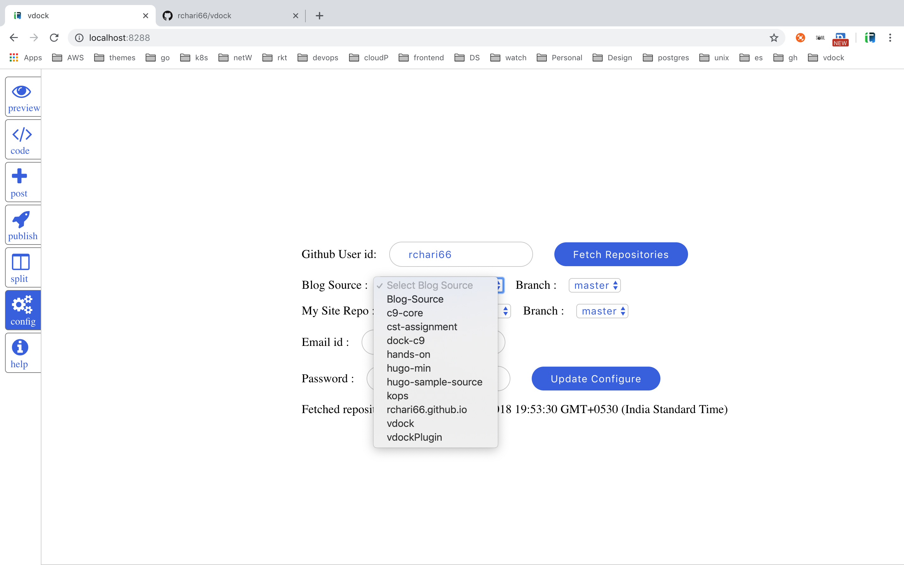
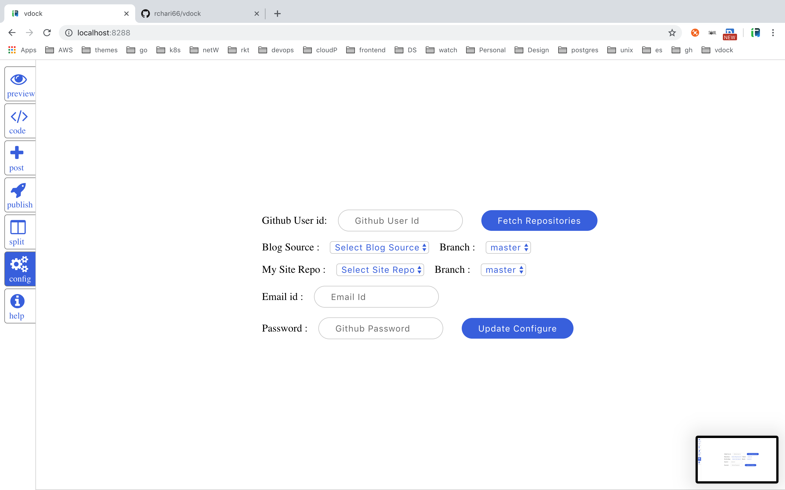

# vdock
#### Intro:
Vdock is a tool with an intergrated IDE for managing [hugo](https://gohugo.io/) site efficiently. 
<br>
It provides features like
* Integrated IDE (Cloud9)
* Live preview(changes)
* 1-click to create new post
* 1-click to publish final site to [github pages](https://pages.github.com/)
* snippets(markdown) to ease content writing

<details><summary> Prerequisities(One time setup) </summary>
<p>

###### Step 1 : Logon to your [Github.com](https://github.com) account.

###### Step 2 : Create a repository for storing your `Blog-Source`

###### Step 3 : Create a repository with name `<Github-userid>.github.io` to host your site.
Suppose If your github-userid is `rchari66` then the repository name would be
> rchari66.github.io
</P>
</details>

---

#### Run :
###### No Authentication & Deny Public Access
``` bash
$ docker run -td -p 8288:8288 -p 8286:8286 rchari/vdock
```
open : http://localhost:8288/


<details><summary> Ways To Run vdock Securely</summary>
<p>

###### With Authentication & Deny Public Access
```bash
$ docker run -td -p 8288:8288 -p 8286:8286 -e AUTH=<username>:<password> rchari/vdock
```

###### No Authentication & Allow Public Access
```bash
$ docker run -td -p 8288:8288 -p 8286:8286 -e ALLOW_PUBLIC_ACCESS=YES rchari/vdock
```
###### With Authentication & Allow Public Access
```bash
$ docker run -td -e AUTH=<username>:<password> ALLOW_PUBLIC_ACCESS=YES \
    -p 8288:8288 -p 8286:8286 rchari/vdock
```
</p>
</details>

---
<br>

#### Configure `vdock` in `config` page
<details><summary>Show config page</summary>
<p>


</P>
</details>

###### Step 1 : Enter your github id and click `fetchRepositories` button
<details><summary>fetch Repositories</summary>
<p>



</P>
</details>


###### Step 2 : Select repositories and Enter Other details.
> Select `hugo-sample-source` and `<Githuh-userid>.github.io` repos for `Blog Source:` and `Blog Destination:`

> Provide Github email and Github password and then Click on button `Update Configure`. 
This will create `blog-source` and `mySite` directries in the IDE.

<details><summary>Udate Config</summary>
<p>




</P>
</details>

---
<br>

#### Configure config.toml(in `blog-source/config.toml`) for hugo
>  Make sure `publishDir` is set to `../MySite`.
```toml
publishDir = "../MySite"
```
> Update `baseURL` to `https://<Github-userid>.github.io`.
```toml
baseURL = "https://rchari66.github.io"
```
---
<br>

#### Publish your site.
> Simply goto `publish` page and click on `Publish Changes`(provide a commit message in textbox).

    Wait for one or two minutes and then open https://<Github-userid>.github.io to view your site.

In case the site in not available after couple of minutes then refer [here](https://help.github.com/articles/configuring-a-publishing-source-for-github-pages/)
for enabling github pages for your repository.
---
<br>

Refer : [How to Create blog posts Using vdock](https://techtaste.me/post/vdock-tool/)


### TODO: Enhancements/Imporovements:
* Support for Gitlab & Bitbucket
* Add Google analytics & disqus config to default themes.
* One click theme(hugo) selection
* Enhance this tool to ease kubernetes related stuff
* 1-Click publish to S3(aws) Bucket
* 1-Click to host the static site on ec2 instance
* Support for dynamic services(Web services by Golang)
